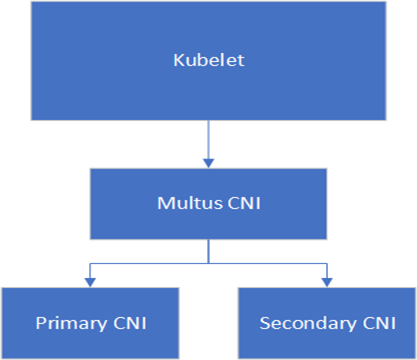

.. license-header
  SPDX-FileCopyrightText: Copyright (c) 2024 NVIDIA CORPORATION & AFFILIATES. All rights reserved.
  SPDX-License-Identifier: Apache-2.0

  Licensed under the Apache License, Version 2.0 (the "License");
  you may not use this file except in compliance with the License.
  You may obtain a copy of the License at

  http://www.apache.org/licenses/LICENSE-2.0

  Unless required by applicable law or agreed to in writing, software
  distributed under the License is distributed on an "AS IS" BASIS,
  WITHOUT WARRANTIES OR CONDITIONS OF ANY KIND, either express or implied.
  See the License for the specific language governing permissions and
  limitations under the License.

.. headings # #, * *, =, -, ^, "

*****************
Multi Network POD
*****************

By default, Kubernetes allows for a single network (primary network) to be connected to a POD.
Kubernetes `network attachment definition custom resources <https://github.com/k8snetworkplumbingwg/multi-net-spec>`_  enhance this capability, and allow users to attach multi-networks for POD, a primary network which runs all of Kubernetes services and one or more secondary networks which are typically used for high performance.
The cluster network CNI plugin (primary plugin) is satisfying Kubernetes' networking requirements.

Below is a list of well known cluster network CNI providers:

.. list-table::
   :header-rows: 1

   * - CNI Provider
     - Project
   * - Calico
     - https://github.com/projectcalico/calico
   * - Flannel
     - https://github.com/coreos/flannel
   * - Canal
     - https://github.com/projectcalico/canal
   * - ovn-kubernetes
     - https://github.com/ovn-org/ovn-kubernetes

The `Multus CNI plugin <https://github.com/k8snetworkplumbingwg/multus-cni>`_ enables attaching multiple network interfaces to pods. Multus is acting as a "meta-plugin", a CNI plugin that can call multiple other CNI plugins.

