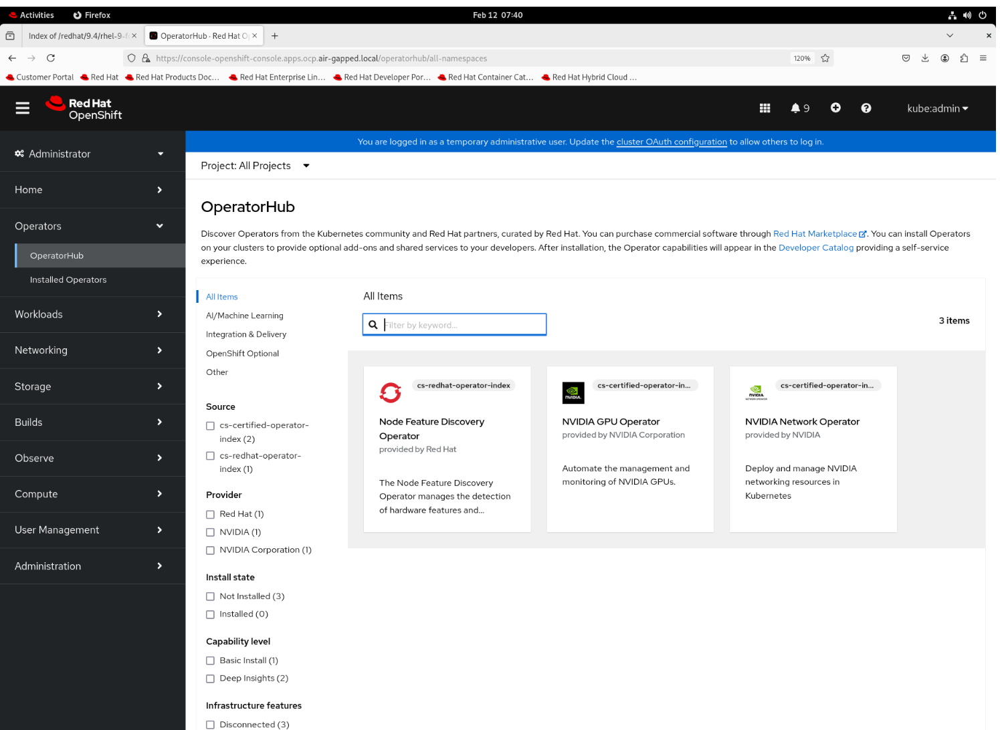

.. license-header
  SPDX-FileCopyrightText: Copyright (c) 2024 NVIDIA CORPORATION & AFFILIATES. All rights reserved.
  SPDX-License-Identifier: Apache-2.0

  Licensed under the Apache License, Version 2.0 (the "License");
  you may not use this file except in compliance with the License.
  You may obtain a copy of the License at

  http://www.apache.org/licenses/LICENSE-2.0

  Unless required by applicable law or agreed to in writing, software
  distributed under the License is distributed on an "AS IS" BASIS,
  WITHOUT WARRANTIES OR CONDITIONS OF ANY KIND, either express or implied.
  See the License for the specific language governing permissions and
  limitations under the License.

.. headings # #, * *, =, -, ^, "

.. include:: ../common/vars.rst

************************************************************
NVIDIA Network Operator Deployment on Disconnected OpenShift
************************************************************

.. contents:: On this page
   :depth: 4
   :local:
   :backlinks: none

Deploying OpenShift operators in an environment with internet access is typically straightforward. However, in industries like cyber security, military sector or Telco/communications, where security concerns often prohibit internet access, the process becomes more complex. In a disconnected or air-gapped environment, internet access is usually restricted or unavailable.

=============
Prerequisites
=============

The following requirements must be met:

* OpenShift is installed in a disconnected environment
* A private registry is deployed in the disconnected environment

--------------------------------
Network Layout and Server Roles
--------------------------------

The following network layout is used in this guide:

.. list-table::
   :header-rows: 1

   * - Server Name
     - Services running on
     - Access to Internet
   * - srv01
     - NTP, DHCP, DNS, HTTP
     - Yes
   * - mirror
     - Mirroring tools, Local Registry
     - Yes
   * - master01, master02, master03
     - Control Plane servers in a cluster
     - No
   * - worker01, worker02
     - Workers in a cluster
     - No

========================================
Mirroring images from public registries
========================================

This section requires an internet connection, for fetching images from public registries.
In our scenario we are using the `mirror` server for this operation.

---------------------
Install OpenShift CLI
---------------------

Follow the instructions in the `OpenShift documentation <https://docs.redhat.com/en/documentation/openshift_container_platform/latest/html/cli_tools/openshift-cli-oc>`_ to install the OpenShift CLI (`oc`).

------------------------
Install oc-mirror plugin
------------------------

To download the `oc-mirror` CLI plugin, navigate to the `downloads page <https://console.redhat.com/openshift/downloads>`_ of the OpenShift Cluster Manager. Under the "OpenShift disconnected installation tools" section, click "Download" for "OpenShift Client (oc) mirror plugin" and save the file.

Extract the archive:

.. code-block:: bash

   tar -xvf oc-mirror.tar.gz
   chmod +x oc-mirror

.. note::
   Do not rename the oc-mirror file

To install the `oc-mirror` CLI plugin, place the file in your PATH. For example:

.. code-block:: bash
	
   sudo mv oc-mirror /usr/local/bin/

Verify that the plugin for `oc-mirror` is installed:

.. code-block:: bash

   oc mirror help

.. note::
   There is no dash (-) between oc and mirror.

If the command returns help options, then the `oc-mirror` CLI plugin is installed.

-----------------------------------
Configure the oc-mirror credentials
-----------------------------------

Download your `registry.redhat.io` pull secret from `Red Hat OpenShift Cluster Manager <https://console.redhat.com/openshift/install/pull-secret>`_.

Convert the pull secret to JSON format:

.. code-block:: bash

  cat ./pull-secret | jq . > config.json

Copy the JSON file to the `.docker` directory:

.. code-block:: bash

  mkdir ~/.docker
  cp config.json ~/.docker/config.json

Log in to `registry.redhat.io`:

.. code-block:: bash

  podman login registry.redhat.io

---------------------------------------------------
Create the oc-mirror ISC (ImageSourceConfiguration)
---------------------------------------------------

The oc-mirror tool uses an ISC configuration file to define what needs to be mirrored. This configuration allows you to specify the catalog source name and the versions of the operators you want to mirror.

Find operator channel and release information for the required OpenShift version (example: 4.19):

.. code-block:: bash

  oc mirror list operators --catalogs --version=4.19

  Available OpenShift OperatorHub catalogs:
  OpenShift 4.19:
  registry.redhat.io/redhat/redhat-operator-index:v4.19
  registry.redhat.io/redhat/certified-operator-index:v4.19
  registry.redhat.io/redhat/community-operator-index:v4.19
  registry.redhat.io/redhat/redhat-marketplace-index:v4.19

In order to mirror NFD and NVIDIA Network-Operator, we will use the following catalogs:

* `redhat-operator-index`
* `certified-operator-index`

Find the channel for NFD operator:

.. code-block:: bash

  oc mirror list operators --catalog=registry.redhat.io/redhat/redhat-operator-index:v4.19 --package=nfd

  NAME  DISPLAY NAME  DEFAULT CHANNEL
  nfd                 stable

  PACKAGE  CHANNEL  HEAD
  nfd      stable   nfd.4.19.0-202508120121

Find the channel for NVIDIA Network Operator:

.. code-block:: bash

  oc mirror list operators --catalog=registry.redhat.io/redhat/certified-operator-index:v4.19 --package=nvidia-network-operator

  NAME                     DISPLAY NAME  DEFAULT CHANNEL
  nvidia-network-operator                v25.7

  PACKAGE                  CHANNEL  HEAD
  nvidia-network-operator  stable   nvidia-network-operator.v25.7.0
  nvidia-network-operator  v25.7    nvidia-network-operator.v25.7.0

Use the `oc mirror` command to create a template for the ISC configuration file.

.. code-block:: bash

  oc mirror init > imagesset-config.yaml

Edit the new ISC file and update it using the right catalog and the operators release information you gathered in the previous steps. Here's an example of an ISC configuration file for our scenario:

.. code-block:: yaml

  kind: ImageSetConfiguration
  apiVersion: mirror.openshift.io/v1alpha2
  storageConfig:
    local:
      path: /path/to/disk-mirror-dir/metadata
  mirror:
    platform:
      channels:
      - name: stable-4.19
        minVersion: 4.19.0
        maxVersion: 4.19.0
        type: ocp
    operators:
    - catalog: registry.redhat.io/redhat/redhat-operator-index:v4.19
      packages:
      - name: nfd
        channels:
        - name: stable
    - catalog: registry.redhat.io/redhat/certified-operator-index:v4.19
      packages:
      - name: nvidia-network-operator
        channels:
        - name: stable
    additionalImages:
    - name: registry.redhat.io/ubi8/ubi:latest
    helm: {}

.. note::
   Please keep in mind that you can decide what will be the max and min version of any channel in any catalog according to your requirements. In our case, to save space on storage, we minimized it to one version only.

-------------------------------------
Create the operators' images TAR file
-------------------------------------

Create a directory for the image's TAR file, and then run the command:

.. code-block:: bash

  mkdir data
  oc mirror --verbose 3 --config=imagesset-config.yaml file://data

Once the operation is completed, the TAR file will appear in created directory:

.. code-block:: bash

  ls -ltrh data/

  total 35G
  drwxr-xr-x. 3 root root  17 Jan 27 07:36 oc-mirror-workspace
  -rw-r--r--. 1 root root 35G Jan 27 07:40 mirror_seq1_000000.tar

===================================================
Upload the container images to the private registry
===================================================

-------------------------------------------------
Move the TAR file to the disconnected environment
-------------------------------------------------

The operational procedures and security requirements can vary significantly from one organization to another. For example, in certain highly restricted environments, you must copy the TAR file to a portable disk, which you take to your disconnected environment's security team for review.

----------------------------------------------------
Mirroring the operator from disk to private registry
----------------------------------------------------

Once the data has been moved to the disconnected environment, you can begin pushing the images in your private registry. Because you've used the `oc-mirror` plugin to push all necessary container images, you must configure the tools accordingly, with the credential information pointing to your private registry instead of the Red Hat public registry.

This is an example of `config.json` file for local registry:

.. code-block:: bash

  cat /mirror-data/config.json
  {
    "auths": {
      "mirror.air-gapped.local:5000": {
      "auth": "aW5pdDpxYXdzMTI="
      }
    }
  }

Create a directory to copy the TAR file, and to serve as the destination for `oc mirror` output:

.. code-block:: bash

  mkdir data

Copy the TAR file to the destination directory:

.. code-block:: bash
 
  mkdir data
  cp mirror_seq1_000000.tar data/
  cd data

Execute the `oc mirror` command to upload the container's images to your private registry:

.. code-block:: bash

  oc mirror --verbose 3 \
  --from=./mirror_seq1_000000.tar \
  docker://mirror.air-gapped.local:5000/ocp/openshift4

Once complete, you get the following directories with similar files:

.. code-block:: bash

  ls -ltr data/oc-mirror-workspace/results-1737982710/
  total 64
  drwxr-xr-x. 2 root root 	6 Jan 27 07:58 charts
  drwxr-xr-x. 2 root root	52 Jan 27 08:03 release-signatures
  -rw-r--r--. 1 root root 49619 Jan 27 08:03 mapping.txt
  -rwxr-xr-x. 1 root root   253 Jan 27 08:03 catalogSource-cs-redhat-operator-index.yaml
  -rwxr-xr-x. 1 root root   259 Jan 27 08:03 catalogSource-cs-certified-operator-index.yaml
  -rwxr-xr-x. 1 root root  1565 Jan 27 08:03 imageContentSourcePolicy.yaml

===============================
Configure the Openshift catalog
===============================

You must be logged in to your OpenShift instance as a user with cluster-admin privileges.
In our setup we are using kubeconfig file created with OCP deployment in isolated network:

.. code-block:: bash

  export KUBECONFIG=/mirror-data/iso_build/brm_static/auth/kubeconfig

Keeping the Openshift default catalogs in a disconnected environment would just trigger unnecessary errors, so disable the default OperatorHub catalog sources:

.. code-block:: bash

  $ oc patch OperatorHub cluster --type json -p '[{"op": "add", "path": "/spec/disableAllDefaultSources", "value": true}]'

Apply the ICSP yaml file:

.. code-block:: bash

  oc apply -f /mirror-data/data/oc-mirror-workspace/results-1737982710/imageContentSourcePolicy.yaml

Next, create the Red Hat catalog, you could run it for each catalog workspace that you have. In our scenario it's: `certified-operator-index` and `redhat-operator-index`: 

.. code-block:: bash

  oc apply -f  data/oc-mirror-workspace/results-1737982710/catalogSource-cs-redhat-operator-index.yaml
  oc apply -f data/oc-mirror-workspace/results-1737982710/catalogSource-cs-certified-operator-index.yaml

Verify that you can see the catalog in the mirrored operators in UI "Operators > OperatorHub":

====================================================
Installing Operators in the disconnected environment
====================================================

The easiest way to install the operators in OpenShift it's using the OpenShift UI. Once you have the OpenShift cluster UI open, follow these steps:

1. Click on Operators > OperatorHub
2. Select the operator to install
3. Keep the default settings and click Install

====================
Create the instances
====================

After successful installation of all operators you must create the instances or polices depending on your use case.

-----------------------
Create the NFD instance
-----------------------

In the web console, click "Operators > Installed Operators", and then "Node Feature Discovery Operator"
In Details > Provided API's look for (NFD) NodeFeatureDiscovery "Create instance"

Once the instance creation will completed you can find it in "Operators > Installed Operators > Node Feature Discovery Operator > All instances"

-------------------------------------------------------------
NVIDIA DOCA OFED driver container in disconnected environment
-------------------------------------------------------------

In case you want to use the NVIDIA DOCA OFED driver container in the disconnected environment, there are two options:

- Option 1: Use the NVIDIA DOCA OFED driver container from NGC

  - This container builds the DOCA OFED driver from source code dynamically, therefore requires mirroring needed dependencies.

- Option 2: Create a precompiled container for the DOCA OFED driver

  - With this option it is not required to mirror dependencies, but it will support only a specific kernel version.

^^^^^^^^^^^^^^^^^^^^^^^^^^^^^^^^^^^^^^^^^^^^^^^^^^^^^^^^^^^^
Option 1: Use the NVIDIA DOCA OFED driver container from NGC
^^^^^^^^^^^^^^^^^^^^^^^^^^^^^^^^^^^^^^^^^^^^^^^^^^^^^^^^^^^^

""""""""""""""""""""""""""""""""""""
Mirroring DOCA OFED Driver Container
""""""""""""""""""""""""""""""""""""

Navigate to the NVIDIA catalog and looking for the right <os-version>-<architecture> suffix tag, such as `doca3.1.0-25.07-0.9.7.0-0-rhel9.6-amd64`.

The mirrored image must be tagged `<driver-version>-<os-version>-<architecture>`, such as `doca3.1.0-25.07-0.9.7.0-0-rhel9.6-amd64` for example.

Note that since OCP 4.19, the os version is now `rhel9.6` instead of `rhcos4.x`.

"""""""""""""""""""""""""""""""""
Create Local Package Repositories
"""""""""""""""""""""""""""""""""

The DOCA-OFED Driver container requires certain packages to be available for the driver installation.
The following packages are required:

.. code-block::

   kernel-headers-${KERNEL_VERSION}
   kernel-devel-${KERNEL_VERSION}
   kernel-core-${KERNEL_VERSION}
   createrepo
   elfutils-libelf-devel
   kernel-rpm-macros
   umactl-libs
   lsof
   rpm-build
   patch
   hostname

For RT kernels following packages should be available:

.. code-block::

    kernel-rt-devel-${KERNEL_VERSION}
    kernel-rt-modules-${KERNEL_VERSION}

Create the Local Package Repository required:

- redhat.repo
- ubi.repo
- cuda.repo

The detailed instructions and examples about how to create local repositories is available in this `article <https://access.redhat.com/solutions/7019225>`_ .
Instructions on how to create a repo file can be found `here <https://access.redhat.com/solutions/2785791>`_.

redhat.repo:

.. code-block:: bash

  [baseos]
  name=rhel-9-for-x86_64-baseos-rpms
  baseurl=http://srv01.air-gapped.local/redhat/9.4/el-9-for-x86_64-baseos-rpms
  gpgkey = file:///etc/pki/rpm-gpg/RPM-GPG-KEY-redhat-release
  gpgcheck = 1
  enabled=1

  [apstream]
  name=rhel-9-for-x86_64-appstream-rpms
  baseurl=http://srv01.air-gapped.local/redhat/rhel-9-for-x86_64-appstream-rpms
  gpgkey = file:///etc/pki/rpm-gpg/RPM-GPG-KEY-redhat-release
  gpgcheck = 1
  enabled=1

ubi.repo:

.. code-block:: bash

  [ubi-9-baseos]
  name = Red Hat Universal Base Image 9 (RPMs) - BaseOS
  baseurl = http://srv01.air-gapped.local/redhat/ubi-9-baseos-rpms
  enabled = 1
  gpgkey = file:///etc/pki/rpm-gpg/RPM-GPG-KEY-redhat-release
  gpgcheck = 1
  [ubi-9-appstream]
  name = Red Hat Universal Base Image 9 (RPMs) - AppStream
  baseurl = http://srv01.air-gapped.local/redhat/ubi-9-appstream-rpms
  enabled = 1
  gpgkey = file:///etc/pki/rpm-gpg/RPM-GPG-KEY-redhat-release
  gpgcheck = 1

cuda.repo:

.. code-block:: bash

  [cuda]
  name=cuda
  baseurl=http://srv01.air-gapped.local/nvidia/cuda
  priority=0
  gpgcheck=1
  gpgkey=http://srv01.air-gapped.local/nvidia/cuda/D42D0685.pub
  enabled=1

Create the ConfigMap for the repos files:

.. code-block:: bash

  oc create configmap repo-config -n nvidia-network-operator  --from-file=redhat.repo --from-file=ubi.repo --from-file=cuda.repo

If self-signed certificates are used for an HTTPS based local repository, a ConfigMap must be created for those certificates:

.. code-block:: bash
  
  oc create configmap cert-config -n nvidia-network-operator --from-file=<path-to-pem-file>

""""""""""""""""""""""""""""""""""""""
Create the NIC Cluster Policy instance
""""""""""""""""""""""""""""""""""""""

In the web console, click "Operators > Installed Operators", and then "NVIDIA Network Operator > NicClusterPolicy > Create NicClusterPolicy"

You need to provide required parameters depending on your setup. After editing and overriding our nic-cluster-policy yaml looks like this:

.. code-block:: yaml

  apiVersion: mellanox.com/v1alpha1
  kind: NicClusterPolicy
  metadata:
    name: nic-cluster-policy
  spec:
    ofedDriver:
      certConfig:
        name: cert-config
      env:
      - name: RESTORE_DRIVER_ON_POD_TERMINATION
        value: "true"
      - name: UNLOAD_STORAGE_MODULES
        value: "true"
      - name: CREATE_IFNAMES_UDEV
        value: "true"
      forcePrecompiled: false
      image: doca-driver
      imagePullSecrets:
      - mirror-registry-ps
      livenessProbe:
        initialDelaySeconds: 30
        periodSeconds: 30
      readinessProbe:
        initialDelaySeconds: 10
        periodSeconds: 30
      repoConfig:
        name: repo-config
      repository: mirror.air-gapped.local:5000/mellanox
      startupProbe:
        initialDelaySeconds: 10
        periodSeconds: 20
      terminationGracePeriodSeconds: 300
      upgradePolicy:
        autoUpgrade: true
        drain:
          deleteEmptyDir: true
          enable: true
          force: true
          podSelector: ""
          timeoutSeconds: 300
        maxParallelUpgrades: 1
        safeLoad: false
        waitForCompletion:
          timeoutSeconds: 0
      version: doca3.1.0-25.07-0.9.7.0-0

Note: Please be sure to provide configured ConfigMaps: `repo-config` and `cert-config`.

^^^^^^^^^^^^^^^^^^^^^^^^^^^^^^^^^^^^^^^^^^^^^^^^^^^^^^^^^^^^^^^^^
Option 2: Create a precompiled container for the DOCA OFED driver
^^^^^^^^^^^^^^^^^^^^^^^^^^^^^^^^^^^^^^^^^^^^^^^^^^^^^^^^^^^^^^^^^

Please verify that you have the following:

* Podman (RH) installed on your build system
* Web access to NVIDIA NIC drivers sources

Follow the instructions in the :ref:`Precompiled Container Build Instructions for NVIDIA DOCA-OFED Driver Container <precompiled-container-build-instructions-for-nvidia-doca-ofed-driver-container>` section to build the precompiled container.

.. note::
   You need to make the created image accessible in your environment (on the local registry server).
   Working with container images is described in this `page <https://docs.redhat.com/en/documentation/red_hat_enterprise_linux/9/html/building_running_and_managing_containers/assembly_working-with-container-images_building-running-and-managing-containers#assembly_working-with-container-images_building-running-and-managing-containers>`_.

In order to get the sha256 of the image, you can use the following command:

.. code-block:: bash

  skopeo inspect docker://mirror.air-gapped.local:5000/mellanox/doca-driver:your-tag | jq -r '.Digest'

""""""""""""""""""""""""""""""""""""""
Create the NIC Cluster Policy instance
""""""""""""""""""""""""""""""""""""""

In the web console, click "Operators > Installed Operators", and then "NVIDIA Network Operator > NicClusterPolicy > Create NicClusterPolicy"

You need to provide required parameters depending on your setup. After editing and overriding our nic-cluster-policy yaml looks like this:

.. code-block:: yaml

  apiVersion: mellanox.com/v1alpha1
  kind: NicClusterPolicy
  metadata:
    name: nic-cluster-policy
  spec:
    ofedDriver:
      env:
      - name: RESTORE_DRIVER_ON_POD_TERMINATION
        value: "true"
      - name: UNLOAD_STORAGE_MODULES
        value: "true"
      - name: CREATE_IFNAMES_UDEV
        value: "true"
      forcePrecompiled: true
      image: doca-driver
      imagePullSecrets:
      - mirror-registry-ps
      livenessProbe:
        initialDelaySeconds: 30
        periodSeconds: 30
      readinessProbe:
        initialDelaySeconds: 10
        periodSeconds: 30
      repository: mirror.air-gapped.local:5000/mellanox
      startupProbe:
        initialDelaySeconds: 10
        periodSeconds: 20
      terminationGracePeriodSeconds: 300
      upgradePolicy:
        autoUpgrade: true
        drain:
          deleteEmptyDir: true
          enable: true
          force: true
          podSelector: ""
          timeoutSeconds: 300
        maxParallelUpgrades: 1
        safeLoad: false
        waitForCompletion:
          timeoutSeconds: 0
      version: sha256:9a831bfdf85f313b1f5749b7c9b2673bb8fff18b4ff768c9242dabaa4468e449

------------------
Image Pull Secrets
------------------

If your local repository requires username and password for access you need to create imagePullSecrets and provide this parameter in nic-cluster-policy.yaml:

.. code-block:: yaml

  imagePullSecrets:
  - mirror-registry-ps

How to create imagePullSecrets:

.. code-block:: bash

  oc -n nvidia-network-operator create secret docker-registry \
  --docker-server=mirror.air-gapped.local:5000 \
  --docker-username=init \
  --docker-password=qaws12 \
  mirror-registry-ps

